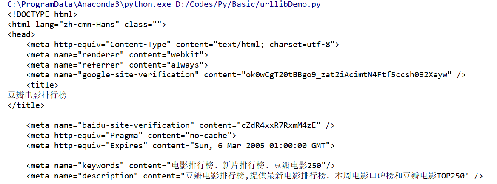

<!-- TOC -->

- [爬虫](#爬虫)
    - [爬虫过程](#爬虫过程)
    - [urllib库](#urllib库)
        - [request的使用](#request的使用)

<!-- /TOC -->

<a id="markdown-爬虫" name="爬虫"></a>
# 爬虫
爬虫：一段自动抓取互联网信息的程序，从互联网上抓取对于我们有价值的信息。

其实，说白了就是爬虫可以模拟浏览器的行为做你想做的事，订制化自己搜索和下载的内容，并实现自动化的操作。

比如浏览器可以下载小说，但是有时候并不能批量下载，那么爬虫的功能就有用武之地了。

Python确实很适合做爬虫，丰富的第三方库十分强大，简单几行代码便可实现你想要的功能，更重要的，Python也是数据挖掘和分析的好能手。

学习Python爬虫的大致步骤如下：

* 首先学会基本的Python语法知识
* 学习Python爬虫常用到的几个重要内置库urllib, http等，用于下载网页
* 学习正则表达式re、BeautifulSoup（bs4）、Xpath（lxml）等网页解析工具
* 开始一些简单的网站爬取（博主从百度开始的，哈哈），了解爬取数据过程
* 了解爬虫的一些反爬机制，header，robot，时间间隔，代理ip，隐含字段等
* 学习一些特殊网站的爬取，解决登录、Cookie、动态网页等问题
* 了解爬虫与数据库的结合，如何将爬取数据进行储存
* 学习应用Python的多线程、多进程进行爬取，提高爬虫效率
* 学习爬虫的框架，Scrapy、PySpider等
* 学习分布式爬虫（数据量庞大的需求）

<a id="markdown-爬虫过程" name="爬虫过程"></a>
## 爬虫过程

其实，爬虫的过程和浏览器浏览网页的过程是一样的。

道理大家应该都明白，就是当我们在键盘上输入网址点击搜索之后，通过网络首先会经过DNS服务器，分析网址的域名，找到了真正的服务器。

然后我们通过HTTP协议对服务器发出GET或POST请求，若请求成功，我们就得到了我们想看到的网页，一般都是用HTML, CSS, JS等前端技术来构建的，

若请求不成功，服务器会返回给我们请求失败的状态码，常见到的503，403等。

爬虫的过程亦是如此，通过对服务器发出请求得到HTML网页，然后对下载的网页进行解析，得到我们想要的内容。

<a id="markdown-urllib库" name="urllib库"></a>
## urllib库
Python有一个内置的urllib库，可谓是爬虫过程非常重要的一部分了。

这个内置库的使用就可以完成向服务器发出请求并获得网页的功能，所以也是学习爬虫的第一步了。

<a id="markdown-request的使用" name="request的使用"></a>
### request的使用
request请求最简单的操作是用urlopen方法，代码如下：

```python
# urllib.request 主要用于打开和阅读url
import urllib.request

# 爬取博客园主页内容
response = urllib.request.urlopen(url='https://www.cnblogs.com/')
html = response.read().decode('utf-8')
print(html)
```

运行结果为：




---

参考引用：

[Python爬虫学习](https://segmentfault.com/a/1190000012681700)